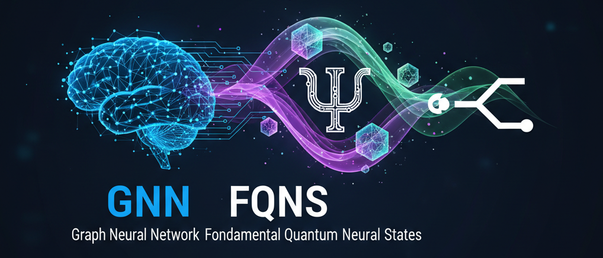

# 🧠 **GNN_FQNS: Graph Neural Network Fundamental Quantum Neural States**





[](https://github.com/javahedi/GNN_FQNS.jl/actions/workflows/CI.yml?query=branch%3Amain)


*A full Variational Monte Carlo engine for disordered quantum magnets*

---

## 📌 Overview

**GNN-FQNS** is a complete, fully tested **Variational Monte Carlo (VMC)** framework for the **disordered spin-1/2 Heisenberg model**, where the quantum wavefunction is represented by a **Graph Neural Network Quantum State (GNN-FQNS)**.

The implementation is:

* **functional & mutation-free**
* **Zygote-compatible (AD-safe)**
* **fully tested (129 tests, all passing)**
* **CPU reference implementation**
* **modular, extensible, and research-ready**

This package provides everything required to simulate disordered quantum magnets using neural-network variational states:
from lattice graphs → wavefunctions → Monte-Carlo sampling → local energies → natural-gradient SR optimization → disorder-averaged training → observables.

---

## 🔧 Features

### ✔ Functional Graph Neural Network Quantum State (GNN-FQNS)

* Message-passing GNN with spin and disorder embeddings
* Outputs **log-amplitude** and **phase**
* Fully readable, mutation-free architecture
* Zygote-safe and differentiable

### ✔ Heisenberg Hamiltonian Physics

* Spin-1/2 disordered Heisenberg model
* Exact diagonal + off-diagonal contributions
* Computes **local energies** efficiently

### ✔ Monte Carlo Sampling

* Metropolis–Hastings sampler for (|\psi|^2)
* Single-spin flip updates
* Vectorized batch evaluation

### ✔ Stochastic Reconfiguration (SR)

* Sorella natural gradient method
* Covariance matrix + force vector
* Solves
  [
  S \Delta\theta = -\eta g
  ]
* Stable and well tested

### ✔ Disorder-Averaged Training Loop

* Multiple disorder realizations per epoch
* Per-disorder sampling and SR step
* Tracks energies and observables

### ✔ Physics Observables

* Magnetization (FM)
* Néel AFM order
* Spin–spin correlation function
* Static structure factor (S(q))

### ✔ Full Test Suite (129 tests)

Covers:

* graph
* GNN
* wavefunction
* sampler
* Hamiltonian
* observables
* SR updates
* full training loop

---

## 📁 Repository Structure

```
GNN_FQNS
├── LICENSE
├── Project.toml
├── Manifest.toml
├── README.md
├── src
│   ├── GNN_FQNS.jl
│   ├── Model
│   │   ├── GNN.jl
│   │   ├── Graph.jl
│   │   └── Wavefunction.jl
│   ├── Optim
│   │   └── SR.jl
│   ├── Physics
│   │   ├── Heisenberg.jl
│   │   └── Observables.jl
│   ├── Sampler
│   │   └── MCMC.jl
│   ├── Training
│   │   └── Train.jl
│   └── Utils
│       ├── Device.jl
│       └── Plotting.jl
└── test
    ├── runtests.jl
    ├── test_gnn.jl
    ├── test_graph.jl
    ├── test_wavefunction.jl
    ├── test_local_energy.jl
    ├── test_sr.jl
    ├── test_mcmc.jl
    ├── test_observables.jl
    └── test_training.jl
```

---

## 🚀 Getting Started

### Requirements

* **Julia ≥ 1.10**
* Standard packages (Flux, Zygote, LinearAlgebra, Random, etc.)

### Install

Clone and instantiate:

```bash
git clone https://github.com/yourusername/GNN_FQNS.git
cd GNN_FQNS
julia --project -e 'using Pkg; Pkg.instantiate()'
```

### Run Tests

```
julia --project -e 'using Pkg; Pkg.test()'
```

---

## 🧪 Example Usage

```julia
using GNN_FQNS

# Build lattice graph
graph = build_square_lattice(L=4)

# Create GNN wavefunction
ψ = GNNWavefunction(graph, MessagePassingGNN(...))

# Train with disorder averaging
history = train_disorder!(ψ; epochs=50, batch_size=256, n_disorder=8)
```

(See `Training/Train.jl` for full API)

---

## 📊 Output & Observables

The package can compute:

* Ground-state energy
* Magnetization
* AFM Néel order
* Spin–spin correlations
* Structure factor

Utility plotting functions (Matplotlib backend) are available in `Utils/Plotting.jl`.

---

## 📚 Citation

If you use this code for research, please cite:

> J. Vahedi et al., **Fundamental Quantum Neural States (FQNS)**, 2025.

(A BibTeX entry can be added once your paper is published.)

---

## 🤝 Contributing

Contributions, bug reports, and feature requests are welcome!
Please open an Issue or Pull Request.

---

## 📄 License

This project is licensed under the **MIT License**.


